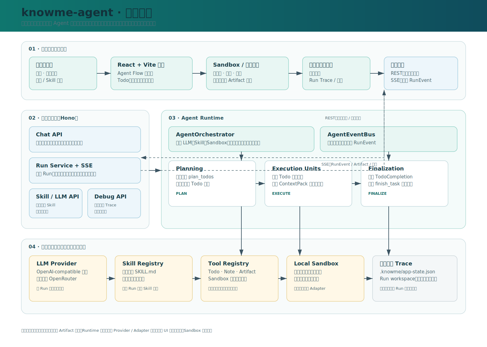
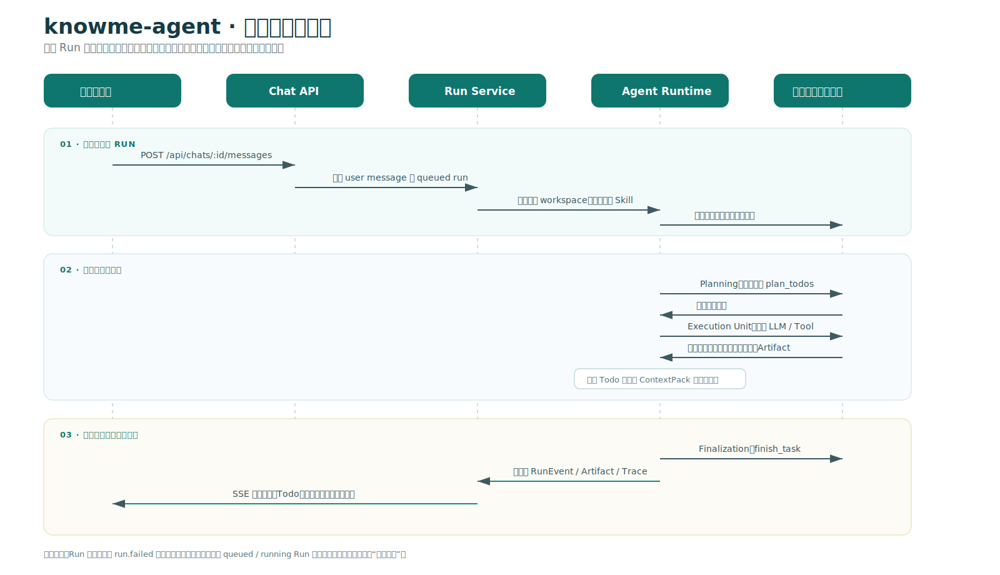

# knowme-agent 架构说明

> 版本定位：当前实现是一套本地可运行的 Agent 工作台与运行时基座。它将“用户任务 → 规划 → 工具执行 → 可预览产物 → 最终答复”组织为可观测、可回放的 Run，而不是一次不可解释的模型调用。

## 1. 架构目标

knowme-agent 的设计重点不是让模型直接回答，而是让任务执行具备工程化的边界和可见性：

- **任务可执行**：用户选择模型与 Skill 后，运行时把请求拆成可推进的 Todo，并通过工具完成实际工作。
- **过程可观察**：规划、Todo、工具调用、沙箱状态、产物和错误统一为事件，前端实时呈现。
- **结果可使用**：文本、HTML、图片、表格、图表、PDF、Slides 和文件等均可作为独立 Artifact 发布、预览或下载。
- **上下文可控**：每个 Todo 使用独立上下文包，只向后续步骤传递完成摘要和引用，避免长任务上下文无限膨胀。
- **实现可替换**：模型 Provider 与 Sandbox Adapter 位于明确边界后；当前为 OpenRouter 与本地 Sandbox，后续可替换为其他兼容实现。

## 2. 总体架构



总体上，系统分为四层：产品工作台、应用服务、Agent Runtime，以及可替换的模型/工具/持久化能力层。前端并不依赖某个具体模型或工具实现，而是消费稳定的 `RunEvent` 与 `Artifact` 契约。

### 2.1 产品工作台：任务入口、过程视图与结果工作区

前端采用 React + Vite，页面由三个连续的工作区域组成：

| 区域 | 职责 | 用户能看到什么 |
| --- | --- | --- |
| 左侧会话栏 | 创建任务、切换历史会话、进入运行日志 | 历史任务、主题设置、调试入口 |
| 中间 Agent Flow | 输入新任务、选择模型与 Skill、消费运行事件 | 计划、Todo、工具调用、阶段总结、最终答复 |
| 右侧 Sandbox / Preview | 展示运行环境和可预览产物 | 浏览器截图、代码、文件、执行脚本、Artifact 预览 |

前端对外提交任务时会同时携带用户指令、模型 ID 和 Skill 名称。运行中的事件通过 SSE 接收；Artifact 的展示方式由自身的 `display` 字段决定，而不是由文件类型硬编码。

### 2.2 应用服务：会话、Run 与实时事件

服务端使用 Hono 提供 REST API 与 SSE：

- `Chat API` 负责创建会话、写入用户/助手消息，以及读取一个会话下的完整时间线。
- `Run Service` 负责创建并异步执行 Run，保存事件与 Artifact，并把实时事件广播到 SSE 订阅者。
- `Skill / LLM API` 向前端暴露可选 Skill 与可用模型目录。
- `Debug API` 读取 Run Trace 和节点级输入、输出、错误证据，服务于调试而非普通用户流程。

Run 的状态只有 `queued`、`running`、`completed`、`failed` 四种。SSE 建连后会先回放已保存事件，再继续订阅实时事件，因此页面刷新或重连不会丢失已经发生的执行进展。

### 2.3 Agent Runtime：三阶段任务编排

`AgentOrchestrator` 是运行时入口。它在一个 Run 内装配模型、Skill、Sandbox、工具注册表、上下文管理器、Artifact 管理器与事件总线，然后按固定的三个阶段推进：

1. **Planning**：模型必须调用 `plan_todos` 生成执行目标和 Todo 计划。若未产出计划，运行时会创建一个兜底 Todo，避免直接进入无计划执行。
2. **Execution Units**：按 Todo 逐个执行。每个 Todo 启动前构建 `ContextPack`；完成后写入 `TodoCompletion`，沉淀产物、文件、沙箱与证据引用，以及可传给后续步骤的摘要。
3. **Finalization**：将所有 Todo 结果、Artifact 与共享摘要交给模型，并通过 `finish_task` 生成最终答复；若模型没有完成调用，运行时仍会写入兜底完成结果。

这种设计将“长任务”从单条长对话转为一组受状态管理的执行单元。后续 Todo 默认不能读取前序步骤的完整私有消息历史，只能使用摘要和引用，因而更利于控制上下文体积与故障定位。

## 3. 单次任务运行链路



一次运行的关键动作如下：

1. 用户在工作台提交任务；服务端记录用户消息并创建 `queued` Run。
2. Run Service 为该 Run 创建独立工作目录，同时把用户选择的 Skill 复制为本次执行的快照。
3. Runtime 检查模型 Provider 是否已配置；当前没有有效 Provider 时，Run 会明确失败，不会伪造 mock 执行结果。
4. Planning 生成 Todo 计划。Execution 阶段依次执行 Todo，并把工具结果归并为 ContextPack 可引用的完成摘要。
5. Artifact 发布、Todo 状态变化、工具状态、沙箱资源和阶段总结均通过 EventBus 变成 `RunEvent`，写入状态存储并通过 SSE 发送到前端。
6. Finalization 生成最终答复；Run 进入完成或失败状态，前端展示最终消息和可预览产物。

## 4. 核心模块与职责边界

| 模块 | 主要职责 | 关键边界 |
| --- | --- | --- |
| `AgentOrchestrator` | 组装运行环境，串联规划、执行、收尾 | 不承担模型细节与 UI 渲染 |
| `PlanningRunner` | 生成并校验 Todo 计划 | 仅开放计划工具 |
| `ExecutionUnitRunner` | 逐项执行 Todo，维护完成摘要 | 每项 Todo 采用隔离上下文 |
| `FinalizationRunner` | 汇总执行结果并生成最终答复 | 仅开放完成工具 |
| `ContextManager` | 构建 `ContextPack`，维护 `TodoCompletion` | 不复制完整历史工具输出 |
| `ToolRegistry / ToolRunner` | 统一注册、限制和执行模型可调用工具 | 模型只能通过工具产生外部副作用 |
| `ArtifactManager` | 创建、发布、版本化 Artifact | 类型与展示策略解耦 |
| `AgentEventBus` | 标准化运行事件并补充步骤/节点关联 | 前端只需要理解稳定事件契约 |
| `LocalSandboxAdapter` | 文件、命令、代码、浏览器和截图能力 | 所有文件路径限制在本 Run 工作区内 |

## 5. 事件与产物：运行时和 UI 的稳定接口

### 5.1 RunEvent

每一个对用户或系统有意义的状态变化都会被表示为 `RunEvent`。事件包含 `runId`、顺序号、标题、详情、状态、可见性、Todo/Trace 关联信息，以及可选的动作或 Artifact 负载。

常用事件类型包括：

- 生命周期：`run.started`、`run.completed`、`run.failed`
- 过程信息：`thought.created`、`summary.created`
- 计划与执行：`todo.created`、`todo.updated`、`tool.started`、`tool.finished`
- 工作台资源：`sandbox.updated`、`approval.requested`
- 结果交付：`artifact.created`、`artifact.updated`、`message.created`

`visibility` 提供四级展示控制：`primary` 用于主要流程，`secondary` 用于低干扰信息，`debug` 用于调试视图，`internal` 仅持久化而不直接展示。这样既能保留完整运行证据，又不会把内部细节挤到用户主视图中。

### 5.2 Artifact

Artifact 是 Agent 和工作台之间的“可交付物契约”。系统支持 `text`、`markdown`、`code`、`html`、`image`、`pdf`、`slides`、`table`、`chart`、`json` 和 `file` 等类型。

Artifact 的 `display.mode` 可为 `inline`、`button`、`preview`、`download` 或 `hidden`。例如，图片可以直接内联在任务流中，HTML 报告可在右侧预览，内部 JSON 则可以仅作为后续工具输入。由展示策略而非类型决定 UI 行为，使新产物类型更容易接入。

## 6. Skill、模型与工具执行

### Skill：按需读取、按 Run 快照

Skill 是以目录组织的能力描述，核心文件是 `SKILL.md`，并可引用 `references/`、`scripts/`、`assets/` 等资源。当前版本不在 Runtime 内部动态选择多个 Skill：前端在任务开始前选定一个 Skill，服务端校验后将其复制进本 Run 的工作目录。这样可以保证执行时所用说明与后续回放一致，也避免模型在执行过程中随意切换能力范围。

当前内置：

- `general-task`：通用的任务规划、工具使用、产物生成与简洁总结。
- `html-report`：从用户材料生成自包含 HTML 报告，包含叙事组织、主题选择、实现、截图验证和 Artifact 发布流程。

### 模型 Provider：保持 API 兼容边界

Runtime 依赖统一的 `LlmProvider` 接口，而非直接依赖某个模型厂商。当前默认通过 OpenRouter 配置模型，底层以 OpenAI-compatible SDK 连接接口；模型列表由服务端提供，并支持在创建 Run 时覆盖本次模型。模型未配置时会显式失败，避免给用户“已完成”的假象。

### 工具与 Sandbox：受控副作用

模型不能直接操作外部环境，只能调用工具。工具包括计划管理、笔记、Artifact、文件读写、补丁、命令/代码执行、浏览器导航与截图等。当前 `LocalSandboxAdapter` 将文件操作限制在本 Run 的 `files` 根目录内，并对执行时长和高风险命令设置约束。

## 7. 隔离、存储与可观测性

每次 Run 有独立的本地工作空间，结构包括：

```text
.knowme/workspaces/<run-id>/
├── files/       # Agent 可读写的输入、输出和临时文件
├── skill/       # 本次运行时的 Skill 快照
├── artifacts/   # 产物空间
├── browser/     # 浏览器相关资源
└── meta.json    # Run、模型、Skill 与目录布局元数据
```

应用状态（会话、消息、Run、事件、Artifact）保存在 `.knowme/app-state.json`。运行日志与 Trace 记录提供从 Run 到阶段、Todo、模型调用、工具调用、Artifact 和错误的关联证据。若服务重启时发现 `queued` 或 `running` Run，系统会把它标记为失败并生成“运行中断”事件，避免前端长期显示不可能完成的任务。

## 8. 当前实现与后续演进

| 主题 | 当前实现 | 可演进方向 |
| --- | --- | --- |
| 模型 | OpenRouter 默认实现，保持 OpenAI-compatible Provider 抽象 | 多 Provider 路由、模型策略和成本治理 |
| Sandbox | 本地 `LocalSandboxAdapter` | 替换为云端隔离环境，同时保持工具名和 UI 协议不变 |
| Skill | 任务前选定一个 Skill，运行中不切换 | 更丰富的 Skill 市场、组合式编排和治理 |
| 状态 | 本地 JSON 状态与文件工作区 | 数据库、对象存储、分布式队列与多租户隔离 |
| 执行 | 单 Run 内按 Todo 顺序执行 | 受依赖约束的并行执行、审批和人工接管 |
| 观测 | 结构化日志、Run Trace、调试页面 | 指标、告警、成本报表与跨 Run 检索 |

## 9. 结论

knowme-agent 的核心价值是把 Agent 从“回答问题的模型界面”提升为“可运行任务的工作台”。通过稳定的事件和产物契约、三阶段 Runtime、Todo 级上下文隔离、Run 工作区快照，以及可替换的模型和 Sandbox 边界，系统可以在当前本地形态下完成真实任务，也为后续接入云端执行与企业级治理保留了清晰的扩展面。

---

## Notion 使用建议

1. 将本文件和 `assets/` 文件夹一起导入或上传；两张 SVG 是可放大查看的架构图。
2. 在 Notion 中把“总体架构”和“单次任务运行链路”图片设为全宽，阅读体验最好。
3. 如需面向非技术读者，可保留第 1、2、3、5、9 节；第 4、6、7、8 节可折叠为“技术附录”。
