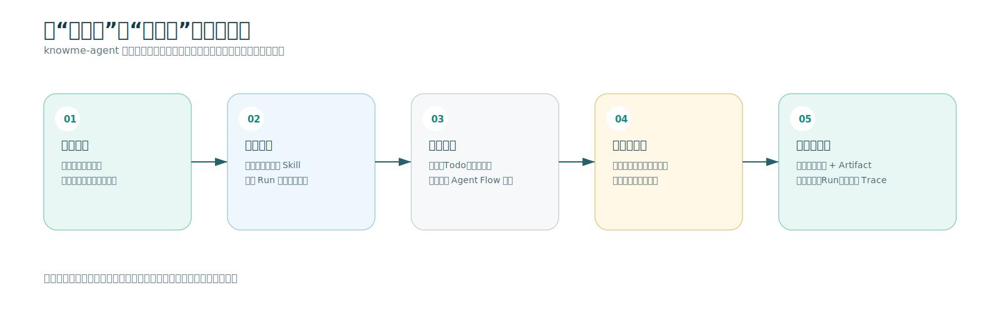

# knowme-agent 产品介绍

> **一句话介绍**：knowme-agent 是一个面向真实任务执行的 Agent 工作台。用户不仅能把任务交给模型，还能选择能力、看见规划、查看工具执行、预览产物，并在同一处追溯最终结果。

## 1. 为什么需要 knowme-agent

通用聊天界面擅长回答问题，但当任务需要多个步骤、文件操作、网页浏览、内容产出或过程审阅时，用户常常会遇到三个问题：

- 不知道 Agent 正在做什么，也无法判断它是否走在正确路径上。
- 结果只有一段文字，无法自然承载报告、HTML、图片、表格、代码等可复用产物。
- 一旦任务失败，很难知道发生在哪一步，更难继续定位和恢复。

knowme-agent 把这些能力收拢到一个任务工作台中：**用任务替代一次性对话，用过程替代黑盒等待，用 Artifact 替代只读答案。**

## 2. 产品能力闭环

用户从描述任务开始，在同一界面完成能力选择、过程跟踪、运行环境审阅、结果预览与历史追溯。每一个阶段都有明确对象：任务对应 Run，执行步骤对应 Todo，最终交付物对应 Artifact。

## 3. 核心能力

### 3.1 任务化交互，而不只是聊天

用户可以新建任务或继续历史会话，以自然语言描述目标。任务创建后，系统保存用户消息并发起一个独立 Run。这样，一项工作不再是会被新对话冲淡的消息，而是一条可查、可回放、有状态的执行记录。

### 3.2 按任务选择模型与 Skill

在提交前，用户可选择本次任务使用的模型和 Skill：

- **模型**决定本次 Run 使用的推理能力。
- **Skill**定义执行这类任务时需要遵守的专业流程与约束。

例如，`general-task` 适合通用任务拆解、工具使用与产物生成；`html-report` 适合把材料整理为可视化 HTML 报告，并在交付前完成浏览器截图验证。选择在任务启动前固定，便于结果复现与后续排查。

### 3.3 让执行过程可见

任务进入运行后，中间的 Agent Flow 会按照时间顺序展示：

- 任务规划和 Todo 拆解
- 当前正在处理的步骤
- 工具调用的开始、完成或失败状态
- 阶段性总结与最终答复
- 已生成的 Artifact 和可打开的操作入口

用户不需要阅读模型的原始思考过程，也仍然可以获得足以判断进展和质量的执行摘要。对于长任务，这种“看得见的工作进展”比单纯加载动画更可信、更可控。

### 3.4 在同一工作台审阅 Agent 的工作环境

右侧的“knowme-agent 的电脑”不是静态附件列表，而是当前 Run 的工作区视图。它将实际执行中的资源组织为：

| 标签页 | 可审阅内容 |
| --- | --- |
| 浏览器 | Agent 导航、点击与截图后的浏览器状态 |
| 代码 | 已发布的代码、HTML、JSON 等产物 |
| 文件 | 图片、PDF、Slides、文本和其他支持预览的文件 |
| 执行脚本 | Shell、Node.js、Python 等命令及其状态、退出码和摘要 |

当 Agent 发布可预览 Artifact 时，用户可直接在右侧打开，而无需在聊天记录中翻找链接或文件。

### 3.5 交付可预览、可下载、可复用的 Artifact

不同任务的正确结果不应总是一段文字。knowme-agent 将结果以 Artifact 管理，支持文本、Markdown、代码、HTML、图片、PDF、Slides、表格、图表、JSON 和文件等类型。

每个 Artifact 都可以声明其展示方式：直接内联展示、在任务流中提供按钮、在工作台预览、作为下载入口，或仅供后续步骤使用。这使 Agent 能把“完成了什么”转为用户真正可查看和复用的内容。

### 3.6 会话沉淀与运行级可追溯性

会话侧保留历史任务；Run 侧保留状态、事件和 Artifact；调试页进一步提供日志、Trace 以及节点级输入/输出/错误证据。日常使用时，用户看到的是简洁的任务工作台；需要排障时，研发人员可以沿着一次 Run 的完整链路定位问题。

## 4. 工作台截图

> **产品截图占位**：请在此插入 knowme-agent 的完整工作台截图，建议使用 16:9 或更宽比例，并保留左侧会话栏、中间 Agent Flow 和右侧 Sandbox / Preview 三个区域。

**建议图注：** knowme-agent 工作台：左侧管理任务会话，中间呈现 Agent 的实时执行流，右侧审阅浏览器、文件、代码和最终产物。

建议在 Notion 中放置以下两张截图，以便让读者快速理解产品：

1. **任务开始页**：展示任务输入框、模型选择器和 Skill 选择器。
2. **任务执行页**：展示完成的 Todo、一个 Artifact 预览，以及右侧 Sandbox 的浏览器/文件/脚本标签页。

## 5. 一个典型使用场景：把材料变成可交付报告

假设用户需要将一组业务材料整理成一份可分享的 HTML 报告：

1. 用户新建任务，粘贴材料并选择 `html-report` Skill。
2. Agent 先拆解工作：理解受众与目标、组织报告叙事、选择视觉主题、生成 HTML、在浏览器中验证页面、发布报告与截图。
3. 用户在 Agent Flow 中看到计划和当前步骤，在右侧工作台查看浏览器预览与生成文件。
4. 任务完成后，用户获得一段简洁总结，以及可直接预览或下载的 HTML 与图片 Artifact。

这个流程将“请模型帮我写一份报告”变成一个可检查、可迭代、可交付的工作过程。

## 6. 产品差异化

| 常见聊天式 Agent | knowme-agent |
| --- | --- |
| 以连续对话为中心 | 以独立任务 Run 为中心 |
| 过程通常不可见 | 通过计划、Todo、工具和阶段总结展示进展 |
| 输出多是一段文本 | 以可预览、可下载的 Artifact 交付结果 |
| 工具执行与结果分散 | 在 Sandbox / Preview 中集中审阅 |
| 故障排查依赖日志拼接 | 保留 Run Trace 与节点级执行证据 |
| 模型能力较难约束 | 在任务开始前显式选择模型和 Skill |

## 7. 适用人群与任务类型

knowme-agent 适合希望把 AI 纳入实际工作流，而不只是获取答案的用户和团队：

- **业务与运营人员**：将材料、数据和笔记整理为报告、表格、页面或演示内容。
- **产品与项目团队**：把需求梳理、竞品研究、方案产出等多步骤任务交给可观察的执行流程。
- **研发与技术支持人员**：执行文件分析、代码生成、浏览器操作、问题排查，并查看每一步证据。
- **Agent 平台建设者**：基于统一的事件、Artifact、Skill 和 Sandbox 边界扩展自己的任务能力。

## 8. 当前产品边界

knowme-agent 当前以清晰、可靠的单 Run 执行为优先，已有几个明确边界：

- 每个任务在开始前选择一个 Skill；Runtime 当前不在执行中自动切换或编排多个 Skill。
- 默认使用本地 Sandbox 运行文件、命令、代码和浏览器操作；未来可替换为云端执行环境。
- 模型使用统一 Provider 接口，当前默认接入 OpenRouter；未配置模型时会明确失败，不会返回模拟成功结果。
- 当前状态主要保存为本地应用状态与 Run 工作区，适合单机开发和验证；面向生产可进一步接入数据库、对象存储、队列和权限体系。

这些边界意味着产品当前已经具备完整的“任务执行闭环”，同时也为多 Skill 编排、云端 Sandbox、协作与企业治理预留了演进空间。

## 9. 总结

knowme-agent 的目标，是让 Agent 像一位可协作的执行者：用户提出目标，选择适当能力，实时看到它如何规划和行动，在需要时查看它的工作环境，最后拿到可使用的结果，并且能够回溯全过程。

它把模型能力放进一个可信、可审阅、可扩展的任务工作台，让 AI 的价值从“生成一句回答”走向“完成一件工作”。

---

## Notion 使用建议

1. 将本文件和 `assets/knowme-agent-product-flow.svg` 一起上传到 Notion；把能力闭环图放在“核心能力”之前或之后并设为全宽。
2. 用实际产品截图替换第 4 节的截图占位；建议保留图注，帮助读者一眼理解三栏布局。
3. 对外版本可直接使用第 1、2、3、4、5、6、7、9 节；第 8 节可作为“当前版本说明”折叠显示。
